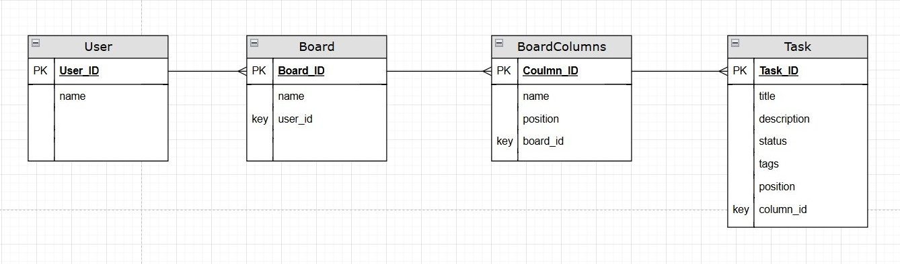

# KANBAN BOARD

## ER Diagram


## Installation

[Installation](Installation.md)

## Running the Application

Option #1 Running : run by typing this code in your terminal, cmd or powershell.
- Run backend (use different terminals for each)
```
cd services/user_service
uvicorn main:app --reload --port 8001


cd services/board_service
uvicorn main:app --reload --port 8002


cd services/notification_service
uvicorn main:app --reload --port 8003
```

Option #2 Running : Using a shell script

```
#!/bin/bash

# Run all services at once
echo "Starting User Service..."
(cd services/user_service && uvicorn main:app --reload --port 8001) &

echo "Starting Board Service..."
(cd services/board_service && uvicorn main:app --reload --port 8002) &

echo "Starting Notification Service..."
(cd services/notification_service && uvicorn main:app --reload --port 8003) &

```

- Run frontend
```
cd front-end
npm install
npm start
```

** Please make sure that your path is in the KANBAN-BOARD directory.

